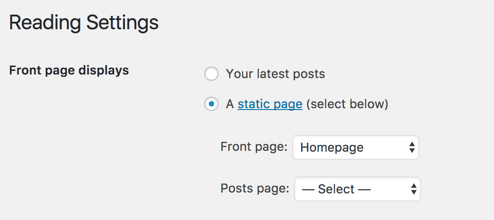
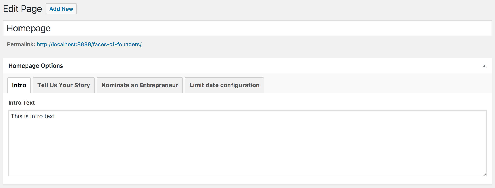
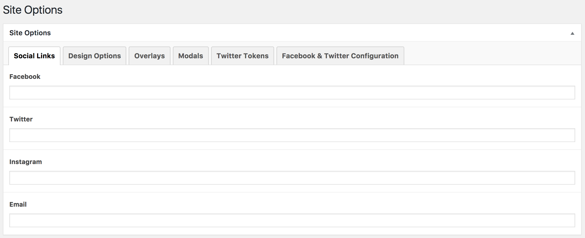
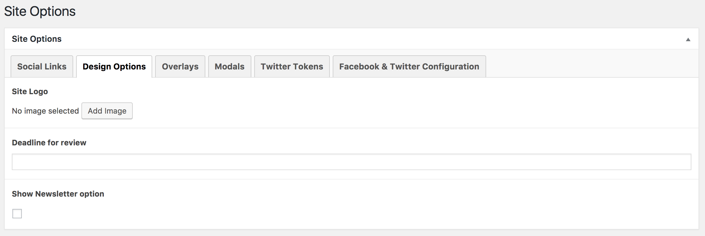
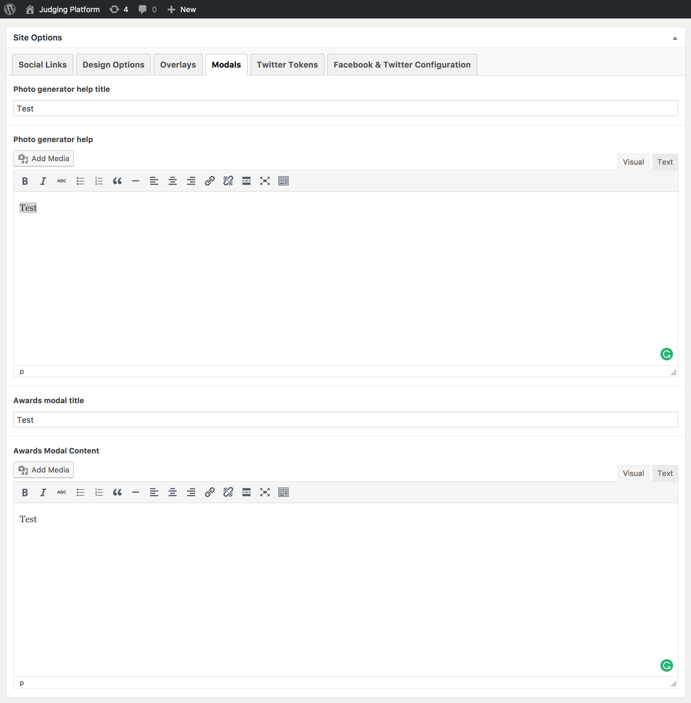
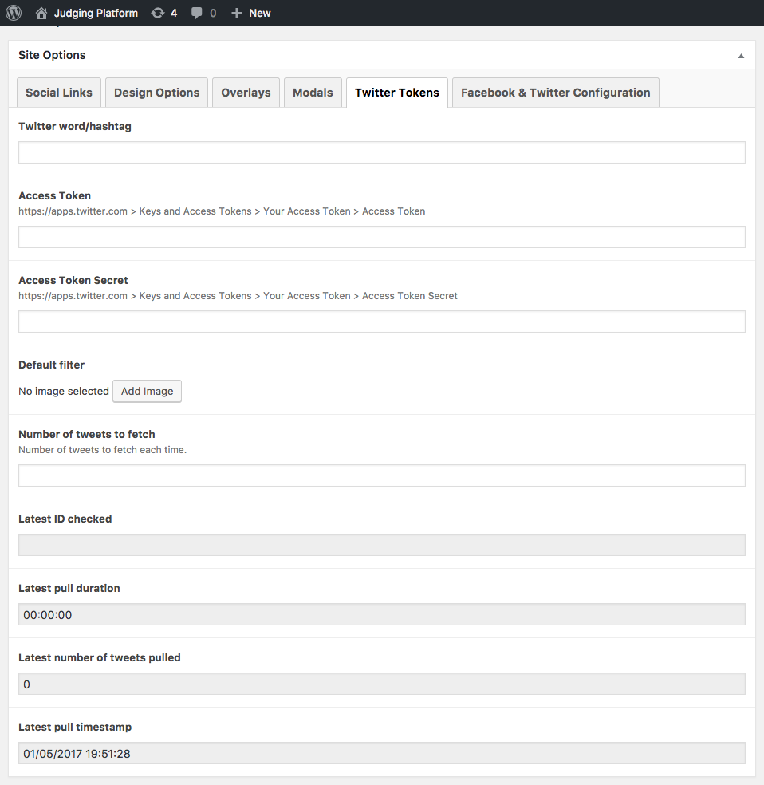
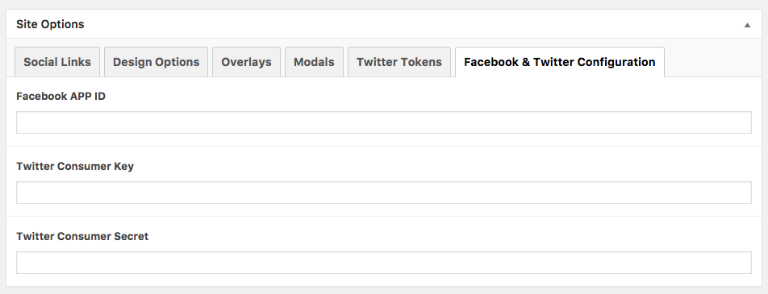

# Setup

## Table of Contents

1. [Installation](#installation)
   1. [WordPress](#wordpress)
   2. [Plugins](#plugins) 	
   3. [Theme](#theme)
   4. [Configuration Files](#configuration-files)
2. [Configuration](#configuration)
   1. [Login With Ajax](#login-with-ajax)
   2. [Homepage Setup](#homepage-setup)
   3. [Site Options](#site-options)
3. [Customizing the Theme](#customizing-the-theme)

## Installation

### WordPress

Because this is a WordPress theme, it requires a full WordPress instance to function. To set up WordPress, visit the [download page](https://wordpress.org/download/) and follow the installation guide, or follow the hosting provider's WordPress-specific installation instructions.

### Plugins

The theme requires two plugins to be installed prior to setup. After installing WordPress, install the following plugins by following each one's setup instructions:

1. [Advanced Custom Fields PRO](https://www.advancedcustomfields.com/)
2. [Login With Ajax](http://wordpress.org/extend/plugins/login-with-ajax/)

### Theme

After WordPress is running with the required plugins, download the folder containing this code into the `wp-content/themes` directory so that it contains a folder named `judging-platform`. The easiest way to do this is to download the ZIP archive from GitHub or check out the project using Git:

```
# cd wp-content/themes
# git clone https://github.com/casefoundation/judging-platform.git
```

### Configuration Files

To configure the fields that will appear in the submitted stories, copy the file `fieldconfig.sample.php` to `fieldconfig.php` in the theme or child theme. In that configuration file, specify exactly three field names and questions that will appear for visitors submitting stories and in the judging review along with the guidance text that should be given to judges when reviewing stories. This configuration is immutable following theme installation.

To configure MailChimp email signup integration so that email signups to the site go into a MailChimp list, copy the file `mailchimpconfig.sample.php` to `mailchimpconfig.php` in the theme or child theme. In that configuration file, specify a MailChimp API key and a MailChimp list ID.

## Configuration

With everything installed, a few configurations must be manually applied:

### Login With Ajax


Configure Login With Ajax by going to the WordPress dashboard and clicking _Settings_ and then _Login with Ajax_ from the sidebar. On the settings screen, under _Role-Based Custom Login Redirects_, set the _Administrator_ and _Editor_ fields to `/dashboard-admin/` and the _Judge_ field to `/dashboard-judge`.

### Homepage Setup

The theme automatically creates the required pages (Dashboard Admin, Dashboard Judge, Login and Review Story) and assigns its template to each page. It is important that these pages are not deleted.



Create a page and configure it as the homepage by going to _Settings_ and then _Reading_ from the WordPress dashboard and select the option _A static page (select below)_ and in the _Front Page_ dropdown choose the page previously created.



Now that page has new fields for the operation of the home page.

### Site Options

The rest of the site is configurable from the _Site Options_ link in the sidebar of the WordPress dashboard.

#### Social Links



This section is for URLs to social networks like Facebook, Twitter, Instagram and Email.

#### Design



These fields control options on the homepage for the site's logo, banner text that provides a submission deadline, and an option to control the email signup box that appears when visitors submit their photos.

#### Overlays


Overlays are the images that visitors may choose to apply to their uploaded photo. All overlay images should be 300x300 pixels, and there must be at least two active overlays for the site to function properly.

#### Modals



On the homepage, there are two help modals that appear upon user request. Set the text for those prompts here.

#### Twitter Tokens



To also accept submissions via the Twitter API, set up a hashtag to monitor and a Twitter OAuth token and secret for WordPress to access the API. The site will run a cron job that queries Twitter based on those credentials and hashtag and apply the specified overlay. (Also a 300x300 pixel image.) To set up a Twitter app with the appropriate credentials, visit [apps.twitter.com](https://apps.twitter.com/).

#### Facebook & Twitter Configuration



To power the Twitter API query and the Twitter and Facebook login buttons from the homepage, also specify the Twitter consumer key and secret and Facebook App ID here. Setting the application keys for Facebook and Twitter allows users to pull-in their profile pictures and also set their generated image as their profile picture.

## Customizing the Theme

To customize the look and feel of this theme, it is possible to either use this as a parent theme or to manually override this theme directly. Note that this theme uses Gulp to build all Javascript and CSS.
