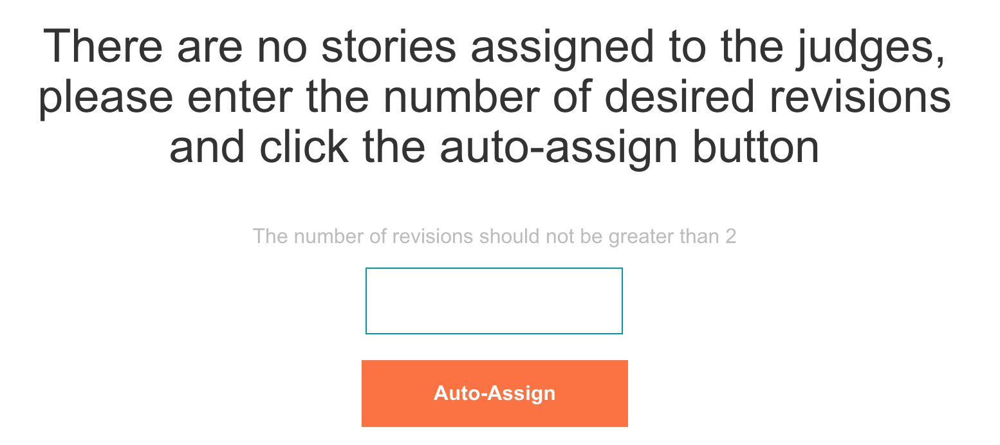

# Use

## Table of Contents

1. [Overview](#overview)
2. [Adding Judges](#adding-judges)
3. [Closing Submissions](#closing-submissions)
4. [Interacting With The Dashboard As An Admin](#interacting-with-the-dashboard-as-an-admin)
   1. [First Run](#first-run)
   2. [Judges](#judges)
   3. [Submissions](#submissions)
   4. [Requests](#requests)
   5. [Recusals](#recusals)
   6. [Export](#export)
5. [Interacting With The Dashboard As A Judge](#interacting-with-the-dashboard-as-an-judge)
   1. [Dashboard](#dashboard)
   2. [Guidelines](#guidelines)
   3. [Request More](#request-more)
   4. [Support](#support)
6. [Manually Adding or Modifying Stories](#manually-adding-or-modifying-stories)
7. [Modifying The Submitted Story Fields](#modifying-the-submitted-story-fields)

## Overview

## Adding Judges

To add new judges, an admin should create a new WordPress user by going to _Users_, _Add New_ from the WordPress dashboard. The admin should make sure to set the new user's role to _Judge_. When users with the role of _Judge_ login, WordPress automatically directs them to the `/dashboard-judge/` page where they can begin interacting with the platform.

## Closing Submissions

## Interacting With The Dashboard As An Admin

### First Run

Upon visiting `/dashboard-admin/` for the first time, admins must assign stories to the judges. The term _revisions_ refers to how many judges will see a submission, in this case a submission can go through 1 or 2 judges.

### Judges

Once inside the admin dashboard, the first view an admin sees is status on judges. The table details the review status of each judge and his or her last login time.

### Submissions

In the dashboard is also a status view for submitted stories. The table details how many judges each story has, the review status of each story, and each story's average score.

### Requests

If a judge requests more stories to review, his or her request appears here. To approve the request, click the row and choose to either reassign stories already assigned to other judges or to assign stories that other judges have recused themselves from.

### Recusals

When a judge does recuse his or herself from a story, the recusal record appears in this table.

### Export

All data in the dashboard may be downloaded as a CSV file.

## Interacting With The Dashboard As A Judge

### Dashboard

Upon login as a judge, WordPress takes the user to the specialized `/dashboard-judge/` page.

### Guidelines

dfdfd

### Request More

dfdfd

### Support

dfdfd

## Manually Adding or Modifying Stories

To add a new submission manually, go to _Stories_ and then _Add New_ from sidebar in the WordPress dashboard. From there, the same fields are available that are available on the front end to submitting users.

To modify a previously submitted story, go to _Stories_ from sidebar in the WordPress dashboard. From there, use the table and WordPress searching/filtering tools to locate the proper story. Click the title/name of submitter to go to the edit screen.

## Modifying The Submitted Story Fields
